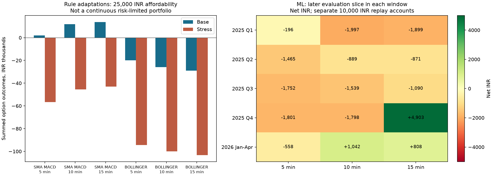

# Algorithm study: real-data results and implementation coverage

This is the earlier study snapshot. Later work adds a [₹25,000 serial options replay](completion-options-study-2026-09-27.md), a [real eight-stock and publication-dated revenue study](completion-equity-study-2026-09-27.md), and a [gated frozen-ML deployment path](completion-verification-2026-09-27.md). The remaining-data and ML limitations listed below describe the earlier build; they are superseded by those completion reports.

The missing mathematical components are implemented. **Keep the new strategies disabled: none of these results establishes reliable live profitability.** The SMA-MACD option adaptation has a small positive base-case average, but loses under execution stress; Bollinger loses in every tested holding period. Twelve of fifteen ML evaluations lose money in the base case.

Evaluated 322 observed NIFTY sessions, 2025-01-01 through 2026-04-23. These are previously studied development data, not a fresh blind holdout. All final evaluation dates remain excluded. No strategy was installed or activated and no order was submitted.



## Option-rule adaptations

Exact signal equations: SMA(5) minus SMA(34) sign changes (including the first available sign), and Bollinger(20, 2 sample standard deviations) outside-band reversal. Their **option adaptation** buys CE for positive signals and PE for negative signals, uses the signal-candle index stop, a 2R index target, and a 5/10/15-minute deadline. This differs from the book's long-stock buy/sell interpretation. Entries use the next minute open; index-driven exits use the next observed option minute open. Stops win intrabar ties.

Each row is a one-lot opportunity study with a ₹25,000 initial-capital affordability check and ₹20,000 premium ceiling, at most three index entries per day, with overlapping positions skipped. It **does not** compound equity or enforce the live ₹1,000 first-trade / ₹1,000 later-trades pool and portfolio drawdown pause. The saved live template adds those admission rules and a separate protective premium stop, so this table is not a live-template portfolio forecast.

| Rule | Hold | Affordable priced trades | Win rate after costs | Net sum, base | Net sum, stress | Largest base loss |
|---|---:|---:|---:|---:|---:|---:|
| sma_macd | 5m | 750 | 44.00% | ₹+2,057.94 | ₹-56,538.69 | ₹-2,209.56 |
| sma_macd | 10m | 732 | 40.57% | ₹+11,848.88 | ₹-45,477.90 | ₹-2,517.80 |
| sma_macd | 15m | 724 | 40.61% | ₹+13,688.16 | ₹-43,073.28 | ₹-2,790.60 |
| bollinger | 5m | 938 | 43.71% | ₹-19,967.56 | ₹-94,313.99 | ₹-1,656.12 |
| bollinger | 10m | 937 | 43.44% | ₹-25,821.62 | ₹-100,036.90 | ₹-3,499.38 |
| bollinger | 15m | 936 | 43.06% | ₹-29,020.48 | ₹-103,183.31 | ₹-4,199.29 |

Base costs apply your current saved Kotak NFO charges retrospectively **as your approved research assumption**, with 10 bps adverse slippage per side and ₹0 brokerage. Stress uses 30 bps and ₹20 per order. The saved September–October 2026 cost schedule is unchanged. Some stress affordability exclusions differ because costs are higher.

| Rule / hold | Unresolved attempts | Affordability exclusions | Base mean P&L 95% day-block interval | Losses greater than ₹1,000 |
|---|---:|---:|---:|---:|
| sma_macd-hold5 | 12 | 8 | ₹-39.44 to ₹43.76 | 24 |
| sma_macd-hold10 | 12 | 8 | ₹-45.11 to ₹76.37 | 44 |
| sma_macd-hold15 | 12 | 8 | ₹-48.10 to ₹83.04 | 53 |
| bollinger-hold5 | 53 | 12 | ₹-62.37 to ₹24.58 | 27 |
| bollinger-hold10 | 58 | 10 | ₹-72.70 to ₹20.48 | 38 |
| bollinger-hold15 | 58 | 9 | ₹-85.12 to ₹27.86 | 48 |

## Chronological ML tests

Each imported 120-session dataset contributes only its first 60 development sessions. The first 42 train the model with three expanding chronological folds; the final 18 are evaluated. The separate final 60 remain sealed. Five distinct data windows × three horizons = fifteen evaluations. Features and training weights cannot use evaluation outcomes. All models use seed 42, 100 trees and probability threshold 0.5; no result-driven retuning occurred.

The canonical ML replay retains the existing **₹10,000 research policy**, ₹1,000 first-trade budget, ₹1,000 shared later-trade budget, ₹2,000 daily loss allowance and 20% drawdown pause. It is distinct from the ₹25,000 option opportunity study above. Each window starts its own account; sums across these runs would not represent one continuous portfolio.

| Data window | Hold | Prediction accuracy | Majority reference | Executed trades | Trade win rate | Net base | Net stress | Max observed drawdown |
|---|---:|---:|---:|---:|---:|---:|---:|---:|
| 2025 Q1 | 5m | 55.86% | 55.51% | 28 | 39.29% | ₹-196.45 | ₹-382.80 | 18.69% |
| 2025 Q1 | 10m | 55.02% | 57.33% | 7 | 28.57% | ₹-1,997.19 | ₹-1,897.14 | 19.97% |
| 2025 Q1 | 15m | 56.84% | 59.30% | 9 | 33.33% | ₹-1,899.06 | ₹-1,997.80 | 18.99% |
| 2025 Q2 | 5m | 49.97% | 57.74% | 19 | 42.11% | ₹-1,464.98 | ₹-1,404.96 | 19.57% |
| 2025 Q2 | 10m | 50.56% | 58.07% | 14 | 64.29% | ₹-888.83 | ₹-1,184.89 | 17.70% |
| 2025 Q2 | 15m | 50.56% | 58.33% | 17 | 41.18% | ₹-871.28 | ₹-1,250.06 | 19.44% |
| 2025 Q3 | 5m | 50.52% | 56.30% | 10 | 20.00% | ₹-1,751.96 | ₹-1,799.86 | 19.66% |
| 2025 Q3 | 10m | 48.43% | 57.16% | 10 | 30.00% | ₹-1,538.52 | ₹-1,712.46 | 19.53% |
| 2025 Q3 | 15m | 50.22% | 57.16% | 13 | 38.46% | ₹-1,089.56 | ₹-1,313.94 | 19.53% |
| 2025 Q4 | 5m | 55.60% | 56.35% | 25 | 56.00% | ₹-1,800.94 | ₹-1,941.63 | 18.71% |
| 2025 Q4 | 10m | 55.17% | 56.04% | 7 | 14.29% | ₹-1,798.23 | ₹-1,918.16 | 18.42% |
| 2025 Q4 | 15m | 56.53% | 57.71% | 50 | 46.00% | ₹+4,902.98 | ₹-1,529.78 | 16.01% |
| 2026 Jan–Apr | 5m | 48.62% | 57.41% | 14 | 35.71% | ₹-557.78 | ₹-762.44 | 18.70% |
| 2026 Jan–Apr | 10m | 53.22% | 57.71% | 33 | 45.45% | ₹+1,042.34 | ₹+651.70 | 16.22% |
| 2026 Jan–Apr | 15m | 54.75% | 57.20% | 19 | 47.37% | ₹+808.22 | ₹+622.42 | 19.11% |

Prediction accuracy counts both profitable and unprofitable opportunity labels, including predictions to skip. Trade win rate counts executed trades only. The majority reference is the larger class in the evaluation slice, not an investable strategy. JSON reports also compare Brier loss against a probability estimated from training data only, with reliability bins, feature importance, and session-block uncertainty where at least ten evaluation sessions exist.

## Portfolio ranking and randomized controls

Bollinger signals with rolling-Sharpe(100) ranking returned **-5.98% gross**, with **18.07%** maximum drawdown. This is a two-index daily proxy experiment (NIFTY / BANKNIFTY), fractional exposure and at most one holding to create meaningful ranking competition. It is not the source repository's five-stock universe and not executable option P&L.

| Control | Repeats | Median gross return | Fraction matching/beating the reference |
|---|---:|---:|---:|
| white_noise | 100 | -3.63% | 86.1% |
| bootstrap_preference | 100 | -4.55% | 79.2% |

These are seeded descriptive null comparisons, not proof of statistical significance. Bootstrapping uses only trailing observable returns at each decision. The nine-setting Bollinger-window / Sharpe-window grid is exploratory and is not used to promote a strategy.

## Coverage and remaining data requirements

| Source component | Implementation and evidence |
|---|---|
| SMA-MACD / Bollinger signals | Independent equations, future-mutation tests, six real-data option variants; two optional disabled templates |
| Rolling Sharpe / portfolio replacement | Next-observed-close fractional-asset engine; real two-index proxy study; source five-stock universe unavailable |
| Grid search / charts | Existing Research optimizer retained; nine proxy combinations tested; every grid ledger and equity curve saved in the supplement |
| White-noise / bootstrapped preference | 100 seeded comparisons each; full return distributions saved |
| CUSUM / nonuniform lag | Causal event selection and as-of calendar lags; fixed and volatility-scaled 5/10/15-minute barriers tested on actual prices |
| Triple barriers | Missing horizons/gaps remain unavailable; close-based event labels separate from conservative intrabar option execution |
| Event uniqueness / RF | Session-balanced overlapping-event weights integrated into the existing technical RF; 15 real evaluations |
| Money flow / CMF | Observed option volumes only; zero-range/warmup values remain unavailable; no standalone trading rule invented |
| Return / volatility / Sharpe / Sortino / Calmar / pure-profit / alpha / drawdown | Implemented in offline analytics; observed aligned NIFTY benchmark, no synthetic SPY benchmark |
| Alternative revenue ML + portfolio | Release-aware adapter, features, purged classifier and event-signal portfolio implemented; **not empirically testable without company revenue releases and publication timestamps** |
| ML live inference | Remains research-only and cannot be promoted; the reference repository is offline and supplies no verified OpenAlgo live adapter |

The upstream source has a restrictive freeware license. The additions implement mathematical ideas independently; upstream code is not bundled. Exact signal equations are preserved, while portfolio fills, bootstrap windows, alternative-data vintages and chronological validation deliberately avoid hindsight. This is coverage of algorithms and research components, not a byte-for-byte port or a claim that every book example is a deployable strategy.

## Using the changes

After restarting OpenAlgo, open **Strategies → Available templates**. The two new entries are **NIFTY SMA 5/34 Zero-Cross (Research)** and **NIFTY Bollinger 20/2 Reversal (Research)**. They remain uninstalled until you choose Install; installation is tested to create a stopped sandbox strategy, no scheduler, and an inactive Flow. Existing strategies are preserved.

In **Research → Historical test → Train a RandomForest model**, choose a maximum holding time of 5, 10 or 15 minutes. Results now include prediction quality, calibration, feature importance and recorded ML inputs. A test does not enable live trading.

## Evidence

- Main run and raw trade/model evidence: `/Users/atanumridha/Documents/AlgoTrading/openalgo/data/research/conlan-algorithms-2026-09-27-verified`.
- Manifest: `/Users/atanumridha/Documents/AlgoTrading/openalgo/data/research/conlan-algorithms-2026-09-27-verified/manifest.json`; source snapshots and input hashes retained.
- Grid ledger supplement: `/Users/atanumridha/Documents/AlgoTrading/openalgo/data/research/conlan-algorithms-2026-09-27-verified/portfolio-ledgers`; recomputed component results match the original study.
- Backend: 3,993 passed, 13 skipped, 1 expected failure. Frontend: 2,786 passed; build passed. Focused post-report/UI checks recorded separately.
- Independent code review completed; signal warmup, missing-bar labels, revenue revisions and short-sample confidence intervals corrected and regression tested.
- Browser: isolated host with real Research API/worker and synthetic UI fixture; five-minute ML run completed and diagnostics displayed. Fixture profit/accuracy is **not** included in this report. Production broker and live settings were untouched.

Reproduce with the optional research environment:

```sh
.venv/bin/python scripts/research_conlan_algorithms.py \
  --output data/research/conlan-new-run --current-kotak-assumption
```

This explicitly chooses the current-fee research assumption. It does not edit saved costs. Choose a new output directory each time.
