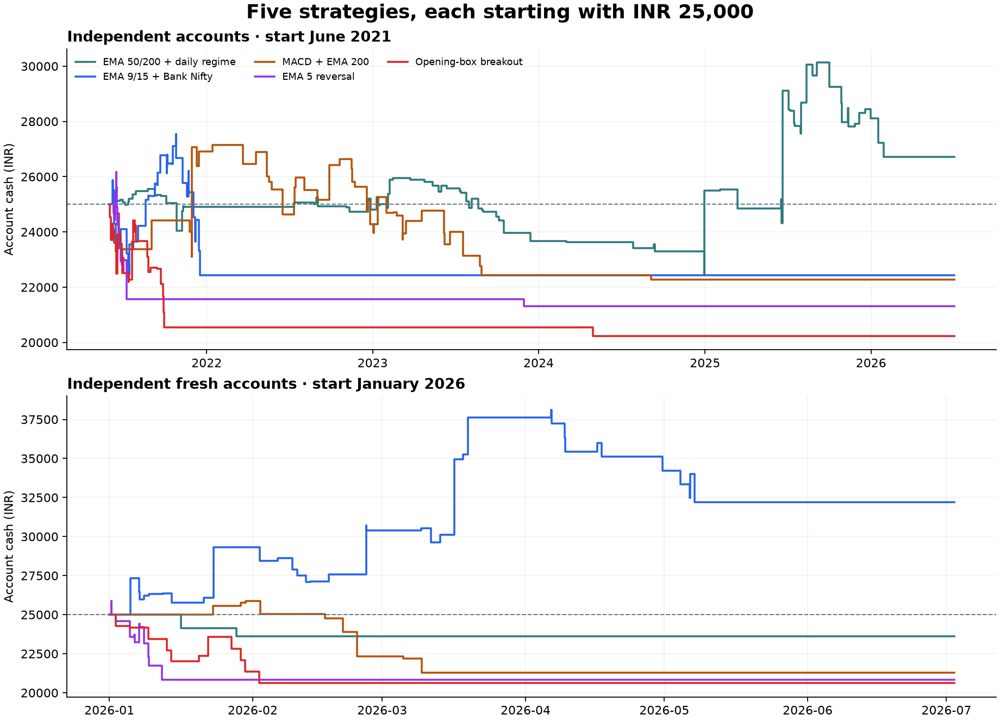

# Five independent trading-account simulations — 27 September 2026

Each strategy was tested on its own with a separate ₹25,000 starting balance. No strategy was funded by another strategy’s profits. The shared-account experiment is shown only as a separate diagnostic.

**Finding:** none is consistently profitable across the full historical window and the higher-cost rerun. EMA 50/200 is the strongest full-window result under normal assumptions, but that small profit disappears at higher slippage. EMA 9/15 has a promising 2026-only result; its longer-window account loses money and becomes risk constrained. These results do not establish a reliable live profit source.

## Full available modern window: 1 June 2021–2 July 2026

Each account starts once and is never topped up or automatically resumed. Normal-case trade counts and win rates follow. “Higher costs” changes slippage only; “Delayed exits” additionally moves intraminute protective fills to the next minute. Different admission and exit paths can change the accepted trade count.

| Strategy | Trades | Net-winning trades | Win rate | Normal net P&L | Ending cash | Higher costs net P&L | Delayed exits net P&L |
|---|---:|---:|---:|---:|---:|---:|---:|
| EMA 50/200 + daily regime | 86 | 34 | 39.5% | +₹1,718.01 | ₹26,718.01 | −₹89.60 | −₹276.50 |
| EMA 9/15 + Bank Nifty | 44 | 19 | 43.2% | −₹2,560.01 | ₹22,439.99 | −₹3,294.81 | −₹3,265.00 |
| MACD + EMA 200 | 49 | 19 | 38.8% | −₹2,724.54 | ₹22,275.46 | −₹2,735.86 | −₹4,784.40 |
| EMA 5 reversal | 32 | 11 | 34.4% | −₹3,690.25 | ₹21,309.75 | −₹4,022.92 | −₹3,953.47 |
| Opening-box breakout | 31 | 8 | 25.8% | −₹4,765.73 | ₹20,234.27 | −₹4,841.37 | −₹4,733.73 |

**Win rate means the proportion of completed trades profitable after modeled costs. It is not ML prediction accuracy.**

The prepared bundle has 100+ observations per strategy only when the older regime supplement is included. Risk controls can allow far fewer orders. In particular, the remaining allowance before the 20% drawdown boundary can become smaller than one lot’s planned loss. That blocks further orders even before a formal drawdown pause. Cash is then carried forward without hypothetical recovery trades or fresh deposits.

| Strategy | Largest marked drawdown | Last accepted entry in normal run | Later entries rejected for drawdown headroom |
|---|---:|---|---:|
| EMA 50/200 + daily regime | 14.03% | 2026-01-28 | 0 |
| EMA 9/15 + Bank Nifty | 18.68% | 2021-12-17 | 502 |
| MACD + EMA 200 | 18.74% | 2024-09-04 | 99 |
| EMA 5 reversal | 18.82% | 2023-11-29 | 2289 |
| Opening-box breakout | 19.06% | 2024-04-29 | 589 |

## Fresh 2026-only accounts: 1 January–2 July 2026

This is a separately declared start-date sensitivity, with a new hypothetical ₹25,000 account for each strategy. It is not a continuation, top-up, or recovery of the accounts above. The archive does not support a complete options replay through September.

| Strategy | Normal trades | Normal win rate | Normal net P&L | Higher costs net P&L | Delayed exits net P&L |
|---|---:|---:|---:|---:|---:|
| EMA 50/200 + daily regime | 2 | 0.0% | −₹1,385.89 | −₹1,467.10 | −₹1,428.18 |
| EMA 9/15 + Bank Nifty | 36 | 50.0% | +₹7,214.86 | +₹7,241.92 | +₹7,393.85 |
| MACD + EMA 200 | 10 | 30.0% | −₹3,711.78 | −₹3,832.87 | −₹3,232.15 |
| EMA 5 reversal | 16 | 25.0% | −₹4,150.64 | −₹3,671.23 | −₹3,804.60 |
| Opening-box breakout | 11 | 18.2% | −₹4,387.63 | −₹4,579.44 | −₹4,999.40 |

The EMA 9/15 result is 18 wins out of 36 normal-case trades, +₹7,214.86, with an 18.22% marked drawdown. The higher-cost rerun accepts 32 trades, so its slightly larger profit is a changed trade path, not evidence that costs help. This sample is too small and previously exposed to research to certify a durable edge. The regime profile has only two eligible 2026 trades; its 0% win rate has very little statistical meaning.

Flat sections represent cash held after skipped opportunities or risk restrictions. They do not represent continuous active trading. Curves show realized cash; the drawdown tables also include marked open-position risk.

## Year-by-year start-date checks

Every cell is a separate fresh ₹25,000 normal-execution account for that year; no annual reset occurs in the continuous full-window test.

| Strategy | 2021 (from June) | 2022 | 2023 | 2024 | 2025 | 2026 (through July 2) |
|---|---:|---:|---:|---:|---:|---:|
| EMA 50/200 + daily regime | −₹96.08 | −₹86.97 | −₹1,146.00 | +₹1,823.18 | +₹2,609.77 | −₹1,385.89 |
| EMA 9/15 + Bank Nifty | −₹2,560.01 | −₹3,579.97 | −₹3,261.31 | +₹3,660.81 | +₹661.39 | +₹7,214.86 |
| MACD + EMA 200 | +₹1,910.09 | −₹1,716.95 | −₹3,142.70 | +₹76.42 | −₹4,270.55 | −₹3,711.78 |
| EMA 5 reversal | −₹3,425.05 | −₹4,800.80 | −₹4,119.52 | −₹3,049.34 | −₹4,376.96 | −₹4,150.64 |
| Opening-box breakout | −₹4,457.72 | −₹2,411.79 | −₹3,038.78 | −₹3,709.72 | +₹4,799.98 | −₹4,387.63 |

The older 2017–2020 monthly-options regime sample is kept separate: 19 accepted trades, 26.3% normal win rate, −₹226.22 normal, −₹559.71 higher costs, and −₹413.74 delayed exits. Its contract structure differs from the modern sample.

The full-window regime result depends on a ₹4,807.68 winning trade on 20 June 2025. Subtracting that winner as a concentration diagnostic changes the total from +₹1,718.01 to −₹3,089.67. The 2026 EMA 9/15 result remains +₹2,400.33 after subtracting its largest ₹4,814.53 winner, but the sample still contains only 36 trades. These are sensitivity calculations; no trades were removed from the reported results.

## Rules and execution assumptions

- ₹25,000 initial capital; one historical option lot; at most one open Nifty position; ₹20,000 premium-plus-entry-fee ceiling and a 20% cash buffer. No borrowing, deposits, compounding of lot count, or unrealized-profit financing.
- First filled trade each day has a ₹1,000 planned net-loss allowance. All later trades share another ₹1,000. Daily planned loss ceiling ₹2,000. Gains do not refill allowances and unused first-trade allowance cannot transfer.
- The existing 20% peak-equity drawdown policy is retained as a simulation assumption. Pauses persist. New entries must fit the remaining drawdown headroom. Cash and equity carry across days.
- Production `BudgetPolicy`, `budget_snapshot`, `evaluate_budget`, and the pure portfolio `evaluate_entry` function are exercised. With the capital profile enabled, absolute risk limits replace the generic percentage limits. Cooldown, three-consecutive-loss lock, cash buffer and session filters still apply.
- Installed entry times are 09:35 for index-based profiles and 09:30 for the opening box. The current NFO governor stops new entries after 14:35 (55 minutes before a normal 15:30 close). A regular-session calendar adapter is used on observed data dates.
- Signals use completed candles; entry uses the following minute’s observed option open. Existing contract selections and dated lot sizes are retained. Index exits use the signal stop and 2R target; maximum hold is 15 minutes.
- The index profiles also use the installed option-premium protection: the smaller of ₹800 gross per lot and 20% of premium, rounded down to a ₹0.05 tick. Opening box uses a 10-point option stop and 20-point target. Thus 2R on the index does not guarantee 2R net on the option.
- Premium stop/target levels are anchored to the simulated filled premium. Gaps fill at the observed worse open. Stops are not clipped to ₹1,000 after the fact; realized losses can exceed a planned allowance.
- Normal case: ₹20 per entry and exit order, 10 bps adverse slippage per side. Higher-cost case: same fees, 30 bps per side. Delayed-exit case: 30 bps plus the next observed minute open for every intraminute exit trigger.
- Underlying-index intraminute exits always use the next option minute open because separate OHLC candles do not reveal synchronized tick prices. Normal premium exits use slipped barrier prices. Protective exits win ambiguous stop/target bars. Delayed exits may benefit from rebounds, so they are sensitivity tests rather than a mathematical worst-case bound.
- Liquidation equity is marked after exit costs at observed opens/closes. Pending delayed exits also record adverse minute lows; these conservative marks can pause an account even if the eventual exit recovers. Favorable intrabar highs do not raise the equity peak.

Both fee scenarios reuse fixed numerical assumptions: exchange 0.0003553, SEBI 0.000001, GST 0.18, buy stamp 0.00003, sell STT 0.0015. This is a uniform current-style comparison, not reconstruction of every historical tariff. The [NSE STT table](https://www.nseindia.com/static/products-services/equity-derivatives-securities-transaction-tax) lists 0.15% on option sales from 1 April 2026, versus 0.10% immediately before then. Applying 0.15% to all historical dates is an explicit conservative scenario assumption. The actual Kotak account plan and all contract-note charges remain unverified; ₹20/order is a model assumption.

## What this test can and cannot establish

This is an account-level replay over the previously prepared, screened opportunity pool, not a complete causal reconstruction of every live signal. That pool retained its original three-candidates-per-day and no-overlap screen, complete observed paths, and initial-affordability eligibility. Early protective exits or rejected orders in this new replay do not regenerate opportunities excluded by the older screen. Missing-data and pre-screening bias therefore remain. No trade was selected because it was profitable, and prior outcome columns were discarded before the replay.

The archive includes data-source disagreements identified earlier. Full-minute price paths passed structural and NSE daily-envelope checks, which do not authenticate every intraday tick. Native bid/ask spreads, quote-age gates, queue priority, partial fills, order rejection, broker outages, and the exact sub-minute scheduling phase cannot be reproduced from this archive. Observed volume and slippage are incomplete liquidity proxies. This is not forward paper qualification or a live-release approval, and the data is not an untouched holdout.

## Combined-account diagnostic

All five together in one ₹25,000 account: 39 normal trades, 30.8% wins, −₹4,446.12, ending ₹20,553.88. Higher costs: −₹4,721.17. Delayed exits: −₹4,674.00, with a persistent drawdown pause on 29 July 2021. Same-time signals use ascending installed strategy ID, fixed before the run. These figures do not replace the independent strategy results above.

## Verification and files

Audited 147 accounts across fixed windows and execution scenarios, 4,018 trade records and 56,795 skip records. These overlap and must not be treated as independent market samples. No unresolved open exposures remained. The 34 delivered bundle files passed their SHA-256 checks. The mechanics and focused production suite passed 144 tests, including stop parity, gap losses, costs, cooldown, drawdown persistence and missing-path handling.

The higher-cost-only diagnostic was registered after the first normal/delay runs to separate the effects of slippage from delay. It did not change signals, risk limits or source selection. Protocols record source hashes and the amendment. Every account folder stores `trades.json`, `skips.json`, `equity.json` and `summary.json`; the independent saved-ledger audit verifies accounting and admission invariants.

- [Simulation and input protocol](../data/research/live-like-simulation-2026-09-27/protocol.json)
- [All normal and delayed results](../data/research/live-like-simulation-2026-09-27/results.json)
- [Higher-cost results](../data/research/live-like-simulation-2026-09-27/cost-sensitivity-results.json)
- [Independent ledger verification](../data/research/live-like-simulation-2026-09-27/verification.json)

No broker orders were sent, and this task did not change the installed trading rules or account capital settings.
